最近项目在用，认真学一遍

<!-- more -->

# 第一课

- 生产环境

- less 

- sass

使用bootstrap 必须引入jquery

# 第二课

- 栅格系统

将整个页面分为12列，通过网格的分配，来统一元素的分布

- 容器
    
    - container-fluid 流体容器 根据屏幕大小自动撑开 自适应整个屏幕  左右分别有 15px的 padding
    - container 固定容器 根据不同的分辨率，宽度会有不同的变化 左右分别有 15px的 padding
        - 1170  大于1200
        - 970   大于992
        - 750   大于768
        - auto  小于768
        
    > 因为padding的关系，尽量不要出现嵌套关系
    
# 第三课 栅格系统

- row 行
- col 列 col-lg-1 占1个列网格，12个占满，如果超过12个会被挤到下一行 用的都是float:left
    - col-lg-* 指超大屏幕的展示，如果低于1200的分辨率，会竖列排列
    - col-md-* 中等屏幕显示的范围 大于992
    - col-sm-* ipad的范围 大于 768
    - col-xs-* 手机范围  小于768
    
- 组合模式

大屏一行排3个 中屏一行排2个

```html
 <div class="row">
        <div class="col-lg-4 col-md-6"></div>
        <div class="col-lg-4 col-md-6"></div>
        <div class="col-lg-4 col-md-6"></div>
    </div>
```

# 第四课 

- 列偏移  col-lg-offset-4 向右偏移4个距离 最多偏移12个，超过不起作用

```html
<div class="container">
    <div class="row">
        <div class="col-lg-4  col-lg-offset-4"></div>
    </div>
</div>
```

当减少分辨率的时候，会竖向排列，不受偏移量的影响

```html
<div class="container">
    <div class="row">
        <div class="col-lg-4  col-lg-offset-4 col-md-offset-4"></div>
    </div>
</div>
```

没有设置md的大小，当适应了md的分辨率，md向右偏移4个距离，那么元素栈8个距离

- 列排序
    - push 往后
    - pull 往前

```html
<div class="container">
    <div class="row">
        <div class="col-lg-2 col-lg-push-10">col-lg-2</div>
        <div class="col-lg-10 col-lg-pull-2">col-lg-10</div>
    </div>
</div>
```

本应该在前面的 `col-lg-2` 因为加了col-lg-push-10 跑到了后面，而col-lg-10 加了pull跑到了前面


offset 只能往右偏移，push 和 pull 可以 右左偏移

offset 当有多个元素存在，一行偏移不够，会折行再去偏移,这种偏移出去的情况可以用push

row嵌套按父级

清楚浮动 clearfix

# 第五课 响应式工具

- 概念 针对不同设备展示或者蕴藏页面的内容
    - 可见类 visible-lg-block 只有当这个元素是lg分辨率下，以block的形式显示出来 还有 inline、inline-display
    - 不可见类 hidden  hidden-sm 在sm的分辨率下隐藏
    - 打印显示类  visible-print-block 打印模式下显示
    - 打印不显示 hidden-print
    

- pull-left 左浮动
- pull-right 右浮动
- row 会自动处理padding
- affix 固定定位


# 第六课 字体图标

很多的小图标可以采用字体图标

- 减少请求
- 容易控制样式

使用设置font路径，如果修改需要打开bootstrap.css  搜索到font-face 修改路径

不要在图标元素中写内容


# 第七课 预定义样式风格

- 按钮
    - btn-primary 首选项 btn btn-primary
    - btn-success 成功
    - btn-info 信息
    - btn-warning 警告
    - btn-danger 危险

- 背景相关
    - bg-primary
    - bg-success 成功
    - bg-info 信息
    - bg-warning 警告
    - bg-danger 危险
    
- 文字
    - text-primary
    - text-success 成功
    - text-info 信息
    - text-warning 警告
    - text-danger 危险

- 警告框
    - alert alert-warning
    - alert alert-danger

- 面板
    - panel panel-primary
    - panel panel-success
    
```html
<div class="panel panel-success">
<h4>title</h4>
<div class="panel-body">
    content
</div>
</div>
```

# 第八课 按钮

- 基类 
    - btn
    - btn-default 带边框的按钮
    - btn-link 像连接的按钮
- 大小 默认值md
    - btn-lg
    - btn-sm
    - btn-xs

- 输入框
   - input
   
- 状态
    - active 选中的状态
    - disabled 禁用状态，鼠标移入禁止
    
  

- 按钮还可以加给a、input、button

- 按钮块级的方式 btn-block

# 第九课 按钮组
    
- btn-group 给按钮加父级
    
```html
<div class="btn-group">
    <input type="button" class="btn btn-primary" value="ok">
    <input type="button" class="btn btn-primary" value="ok">
    <input type="button" class="btn btn-primary" value="ok">
</div>
```

- btn-group-justified 以父容器的内容作为适应，做到端点， 但只能用在a标签，如果input和button也想用，必须每一个按钮元素分别嵌套btn-group

```html
<div class="btn-group btn-group-justified">
    <a href="#" class="btn btn-primary">ok1</a>
    <a href="#" class="btn btn-primary">ok1</a>
    <a href="#" class="btn btn-primary">ok1</a>
</div>
```

```html
<div class="btn-group btn-group-justified">
    <div class="btn-group">
        <input type="button" class="btn btn-primary" value="ok">
    </div>
    <div class="btn-group">
        <input type="button" class="btn btn-primary" value="ok">
    </div>
</div>
```
 
- btn-group-vertical 不用加 btn-group
    
```html
<div class="btn-group-vertical">
    <a href="#" class="btn btn-primary">ok</a>
    <a href="#" class="btn btn-primary">ok</a>
    <a href="#" class="btn btn-primary">ok</a>
</div>
```    

- 大小 btn-group-lg btn-group-sm btn-group-xs
    

- 按钮加向下箭头 caret

```html
<a href="#" class="btn btn-primary">button<span class="caret"></span></a>
```

```html
<button class="btn btn-success">button<span class="caret"></span></button>
```

不适用于input，如果有图标的情况应考虑 `a`、`input`

在按钮组的情况下可以让下拉单独成一个button

> 如何改为向上的箭头？

需要给父级加dropup的类

```html
<div class="btn-group dropup">
    <button class="btn btn-primary">button</button>
    <button class="btn btn-primary"><span class="caret"></span></button>
</div>
```

# 第十课 下拉菜单

```html
<div class="dropdown">
  <button class="btn btn-default dropdown-toggle" type="button" id="dropdownMenu1" data-toggle="dropdown" aria-haspopup="true" aria-expanded="true">
    Dropdown
    <span class="caret"></span>
  </button>
  <ul class="dropdown-menu" aria-labelledby="dropdownMenu1">
    <li><a href="#">Action</a></li>
    <li><a href="#">Another action</a></li>
    <li><a href="#">Something else here</a></li>
    <li role="separator" class="divider"></li>
    <li><a href="#">Separated link</a></li>
  </ul>
</div>
```

`data-*` js交互触发器的写法 toggle切换
`aria-*` haspopup 是否有弹出菜单 expanded 现在菜单展开的状态 labelledby 能读到 Dropdown 
`role` 描述状态而 aria是状态行为的描述

如果用div模拟复选框，需要加role

```html
<div role="checkbox" aria-label="checked"></div>
```

如果想展示下拉菜单给class中加open


ul上加dropdown-menu-left 菜单靠左，dropdown-menu-right
如果想让下拉的菜单用`btn-block`显示，如果想靠左靠右直接在父级div上加 `pull-right`会影响显示，可以用上面的给ul加 `dropdown-menu-left` `dropdown-menu-right`

# 第十一课

下拉菜单不占高度

ul 下拉中ul的展示可以用btn-block 也可以设置宽度

下拉项li中可以设置不选项，可以用类 `dropdown-header`

下拉项li中可以设置分隔线 `divider`

active 为选中项

disabled 为禁用项

菜单默认都是下拉，如何上拉？ 将父级的dropdown 改为 dropup

```html
<div class="dropup">
  <button class="btn btn-default dropdown-toggle" type="button" id="dropdownMenu1" data-toggle="dropdown" aria-haspopup="true" aria-expanded="true">
    Dropdown
    <span class="caret"></span>
  </button>
  <ul class="dropdown-menu" aria-labelledby="dropdownMenu1">
    <li><a href="#">Action</a></li>
    <li><a href="#">Another action</a></li>
    <li><a href="#">Something else here</a></li>
    <li role="separator" class="divider"></li>
    <li><a href="#">Separated link</a></li>
  </ul>
</div>
```

如何将下拉的文字居中 给每个li 加 text-center

下拉菜单不仅可以给button 还可以给a

# 第十二课

鼠标移入出现下拉菜单，但是bootstrap是移动优先，并没有设计鼠标移入

但是如果给下拉加mouseover的逻辑，在移动端的时候点击下拉，会出现pc端移入的效果，我们可以使用进行设备判断

```js
// 这个是pc 端的判断
var timer = null; // 之所以加延迟，是因为btn到下拉
if(window.navigator.userAgent.toLocaleLowerCase().indexOf('mobile') == -1) {
    $('.dropdown').hover(function () {
        $('.dropdown').add('open');
    }, function () {
        timer = setTimeout(function() {
          $('.dropdown').remove('open');
        }, 100)
    });
    $('.dropdown-menu').hover(function () {
            clearTimeout(timer)
        }, function () {
         timer = setTimeout(function() {
           $('.dropdown').remove('open');
         }, 100)
     });
}
```

```js
$('.dropdown-toggle').dropdown();
// 这句话类似在html中写data-toggle="dropdown，但是点击屏幕中其他位置无法隐藏
// 用这个写法的好处就是下拉相互独立， 没有这句 如果存在多个下拉的时候，点开其中一个下拉，另外的下拉会关闭
```

```js
$('.dropdown-toggle').dropdown('toggle'); //如果菜单隐藏，用这个方法菜单就会显示

$('.dropdown').on('show.bs.dropdown', function() {
  // 菜单显示前触发
})
$('.dropdown').on('shown.bs.dropdown', function() {
  // 菜单显示后触发
})
$('.dropdown').on('hide.bs.dropdown', function() {
  // 菜单隐藏前触发
})
$('.dropdown').on('hiden.bs.dropdown', function() {
  // 菜单隐藏后触发
})
```

如果想实现几个下拉同时下拉操作，可以使用data-target='.dropdown', 指定了元素后，可以通过一个控制多个

而其他之前没有用data-toggle="dropdown"的下拉，点其他地方不收的下拉，也变得可控制，点其他地方也可以收下拉

# 第十三课 标签页

整体宽和父级容器的宽度一样

- nav-tabs

```html
<div class="container">
    <ul class="nav nav-tabs">
        <li class="active"><a href="#">one</a></li>
        <li><a href="#">two</a></li>
        <li><a href="#">three</a></li>
    </ul>
</div>
```
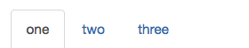

默认情况自适应

- nav-justified 自适应父级的宽度 端点对齐

当分辨率小于768，会变成树型

```html
<div class="container">
    <ul class="nav nav-tabs nav-justified">
        <li class="active"><a href="#">one</a></li>
        <li><a href="#">two</a></li>
        <li><a href="#">three</a></li>
    </ul>
</div>
```

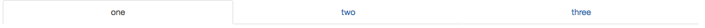

- nav-tabs-justified 线的宽度按内容显示

按照最小的显示
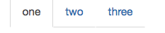

- nav-pills 

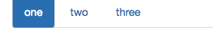


- nav-stacked 常与 nav-pills结合

```html
<div class="container">
    <ul class="nav nav-tabs nav-pills nav-stacked">
        <li class="active"><a href="#">one</a></li>
        <li><a href="#">two</a></li>
        <li><a href="#">three</a></li>
    </ul>
</div>
```

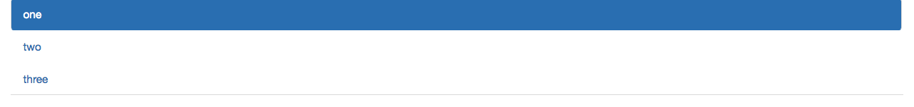


下拉菜单和tab 结合显示
```html
<div class="container">
    <ul class="nav nav-tabs">
        <li class="active"><a href="#">one</a></li>
        <li><a href="#">two</a></li>
        <li class="dropdown">
            <a href="#" class="dropdown-toggle" data-toggle="dropdown">
                three
                <span class="caret"></span>
            </a>
            <ul class="dropdown-menu">
                <li><a href="#">child1</a></li>
                <li><a href="#">child1</a></li>
            </ul>
        </li>
    </ul>
</div>
```

# 第十四课 标签页内容页


```html
<div class="container">
    <ul class="nav nav-tabs">
        <li class="active"><a href="#aaa" data-toggle="tab">one</a></li>
        <li><a href="#bbb" data-toggle="tab">two</a></li>
        <li><a href="#ccc" data-toggle="tab">three</a></li>
    </ul>
    <ul class="tab-content">
        <li id="aaa" class="tab-pane active">1111111</li>
        <li id="bbb" class="tab-pane">222222</li>
        <li id="ccc" class="tab-pane">333333 </li>
    </ul>
</div>
```

如果要控制宽度，需要给父级加整体的宽度

修改 `.tab-content` 可对content 设置不同的样式

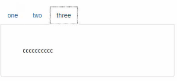


- 淡入淡出 fade 淡入淡出 默认隐藏 需要加in

```html
<div class="container">
    <ul class="nav nav-tabs">
        <li class="active"><a href="#aaa" data-toggle="tab">one</a></li>
        <li><a href="#bbb" data-toggle="tab">two</a></li>
        <li><a href="#ccc" data-toggle="tab">three</a></li>
    </ul>
    <ul class="tab-content">
        <li id="aaa" class="tab-pane fade in active">1111111</li>
        <li id="bbb" class="tab-pane fade">222222</li>
        <li id="ccc" class="tab-pane fade">333333 </li>
    </ul>
</div>
```

- 鼠标移入的方式

```html
<div class="container">
    <ul id="myTabs" class="nav nav-tabs">
        <li class="active"><a href="#aaa" data-toggle="tab">one</a></li>
        <li><a href="#bbb" data-toggle="tab">two</a></li>
        <li><a href="#ccc" data-toggle="tab">three</a></li>
    </ul>
    <ul class="tab-content">
        <li id="aaa" class="tab-pane fade in active">1111111</li>
        <li id="bbb" class="tab-pane fade">222222</li>
        <li id="ccc" class="tab-pane fade">333333 </li>
    </ul>
</div>
```

```js
$('#myTabs a').mouseover(function() {
  $(this).tab('show'); // 显示
})
```

- 带下拉的标签页

```html
<div class="container">
    <ul class="nav nav-tabs">
        <li class="active"><a href="#" data-toggle="tab">one</a></li>
        <li><a href="#b" data-toggle="tab">two</a></li>
        <li class="dropdown">
            <a href="#" class="dropdown-toggle" data-toggle="dropdown">
                three
                <span class="caret"></span>
            </a>
            <ul class="dropdown-menu">
                <li><a href="#c" data-toggle="tab">child1</a></li>
                <li><a href="#d" data-toggle="tab">child1</a></li>
            </ul>
        </li>
    </ul>
    <ul class="tab-content">
        <li id="a" class="tab-pane fade in active">1111111</li>
        <li id="b" class="tab-pane fade">222222</li>
        <li id="c" class="tab-pane fade">333333</li>
        <li id="d" class="tab-pane fade">444444</li>
    </ul>
</div>
```

# 第十五课 导航条

```html
<div class="container">
    <nav class="navbar navbar-default">
        <ul class="nav navbar-nav">
            <li class="active"><a href="">one</a></li>
            <li><a href="">one</a></li>
            <li><a href="">one</a></li>
        </ul>
    </nav>
</div>
```

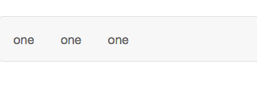
常见的写法是把容器写到navbar里面

```html
<nav class="nav navbar-default">
<div class="container">
    <ul class="nav navbar-nav">
        <li class="active"><a href="#">one</a></li>
        <li class="active"><a href="#">one</a></li>
        <li class="active"><a href="#">one</a></li>
    </ul>
</div>
</nav>
```

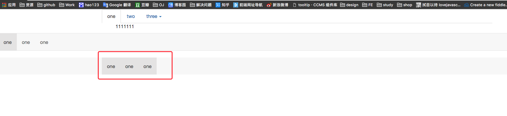

如果container 换为 container-fluid 会变成自适应

- navbar-inverse 加在相反的色调 加在nav的class上

```html
<nav class="navbar navbar-inverse">
    <div class="container">
        <ul class="nav navbar-nav">
            <li class="active"><a href="#">one</a></li>
            <li class="active"><a href="#">one</a></li>
            <li class="active"><a href="#">one</a></li>
        </ul>
    </div>
</nav>
```


- navbar-static-top 两边的脚变为直角

```html
<nav class="navbar navbar-inverse navbar-static-top">
    <div class="container">
        <ul class="nav navbar-nav">
            <li class="active"><a href="#">one</a></li>
            <li class="active"><a href="#">one</a></li>
            <li class="active"><a href="#">one</a></li>
        </ul>
    </div>
</nav>
```

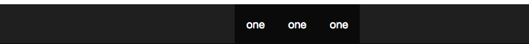


- 固定的滚动条 navbar-fixed-top 固定定位到顶  navbar-fixed-botton 固定定位到底部

如果固定了导航条，写底下的内容的时候会遮挡底下的内容 可以给body 一个margin-top的值


# 第十六课 导航条

导航条logo

- 增加logo

```html
<nav class="navbar navbar-inverse navbar-static-top">
    <div class="container">
    <a href="#" class="navbar-brand">logo</a>
        <ul class="nav navbar-nav">
            <li class="active"><a href="#">one</a></li>
            <li class="active"><a href="#">one</a></li>
            <li class="active"><a href="#">one</a></li>
        </ul>
    </div>
</nav>
```
在移动的时候，logo会消失

```html
<nav class="navbar navbar-inverse navbar-static-top">
    <div class="container">
    <div class="navbar-header">
        <a href="#" class="navbar-brand">logo</a>
    </div>
        <ul class="nav navbar-nav">
            <li class="active"><a href="#">one</a></li>
            <li class="active"><a href="#">one</a></li>
            <li class="active"><a href="#">one</a></li>
        </ul>
    </div>
</nav>
```
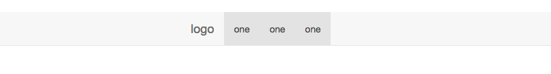

- 默认靠左，可以在ul上用 navbar-right 让它靠右


- 在导航中加按钮 navbar-btn 就可以居中

- 如果加链接 navbar-link

- 加文字 navbar-text

- 导航中输入框 

```html
<nav class="navbar navbar-inverse navbar-static-top">
    <div class="container">
        <div class="navbar-header">
            <a href="#" class="navbar-brand">logo</a>
        </div>
        <p class="navbar-text">文字</p>
        <form class="navbar-form navbar-left">
            <input type="text" class="form-control" placeholder="提示信息">
            <input type="submit" class="btn" value="search">
        </form>
        <a href="#" class="navbar-link">链接</a>
        <button class="btn navbar-btn">登录</button>
        <ul class="nav navbar-nav">
            <li class="active"><a href="#">one</a></li>
            <li class="active"><a href="#">one</a></li>
            <li class="active"><a href="#">one</a></li>
        </ul>
    </div>
</nav>
```

知乎举例

```html
<nav class="navbar navbar-default navbar-fixed-top">
    <div class="container">
        <div class="navbar-header">
            <a href="#" class="navbar-brand"></a>
        </div>
        <form class="navbar-form navbar-left">
            <div class="input-group">
                <input type="text" class="form-control" placeholder="搜索问题" style="width: 320px">
                <span class="input-group-addon"><a href="#"><span class="glyphicon glyphicon-search"></span></a>
                </span>
            </div>
        </form>
        <ul class="nav navbar-nav navbar-left" >
            <li><a href="#">首页</a></li>
            <li><a href="#">话题</a></li>
            <li><a href="#">发现</a></li>
        </ul>
        <ul class="nav navbar-nav navbar-right" >
            <li><a href="#"><i class="glyphicon glyphicon-user"></i>注册</a></li>
            <li><a href="#">登录</a></li>
        </ul>
        <button class="btn btn-primary navbar-btn navbar-right">提问</button>
    </div>
</nav>
```

# 第十七课 导航条的使用

- 带菜单的导航条

```html
<nav class="navbar navbar-default navbar-static-top">
    <div class="container">
        <div class="navbar-header">
            <a href="#" class="navbar-brand">logo</a>
        </div>
        <ul class="nav navbar-nav">
            <li class="active"><a href="#">one</a></li>
            <li ><a href="#">one</a></li>
            <li >
                <a href="#" class="dropdown-toggle" data-toggle="dropdown">one  <i class="caret"></i></a>
                <ul class="dropdown-menu">
                    <li><a href="#">111</a></li>
                    <li><a href="#">111</a></li>
                </ul>
            </li>
        </ul>
    </div>
</nav>
```
- 自适应的导航条（移动下汉堡导航条） 加 给菜单加父类 ul 加collapse navbar-collapse
```html
<nav class="navbar navbar-default navbar-fixed-top">
    <div class="container">
        <div class="navbar-header">
            <button class="navbar-toggle" data-toggle="collapse" data-target="#myCollapse">
                <span class="icon-bar"></span>
                <span class="icon-bar"></span>
                <span class="icon-bar"></span>
            </button>
            <a href="#" class="navbar-brand">logo</a>
        </div>
        <div class="collapse navbar-collapse" id="myCollapse">
            <ul class="nav navbar-nav">
                <li class="active"><a href="#">one</a></li>
                <li class="active"><a href="#">one</a></li>
                <li class="active"><a href="#">one</a></li>
            </ul>
        </div>
    </div>
</nav>
```

- 滚动监听 整页面中跳转

```html

<nav id="navbar-example" class="navbar navbar-default navbar-static" role="navigation">
    <div class="container">
        <div class="navbar-header">
            <a class="navbar-brand" href="#">教程名称</a>
        </div>
        <div class="collapse navbar-collapse ">
            <ul class="nav navbar-nav">
                <li><a href="#ios">iOS</a></li>
                <li><a href="#svn">SVN</a></li>
            </ul>
        </div>
    </div>
</nav>
<div data-spy="scroll" data-target="#navbar-example" data-offset="0"
     style="height:200px;overflow:auto; position: relative;">
    <h4 id="ios">iOS</h4>
    <p>iOS 是一个由苹果公司开发和发布的手机操作系统。最初是于 2007 年首次发布 iPhone、iPod Touch 和 Apple
        TV。iOS 派生自 OS X，它们共享 Darwin 基础。OS X 操作系统是用在苹果电脑上，iOS 是苹果的移动版本。
    </p>
    <h4 id="svn">SVN</h4>
    <p>Apache Subversion，通常缩写为 SVN，是一款开源的版本控制系统软件。Subversion 由 CollabNet 公司在 2000 年创建。但是现在它已经发展为 Apache Software Foundation 的一个项目，因此拥有丰富的开发人员和用户社区。
    </p>
    <h4 id="jmeter">jMeter</h4>
    <p>jMeter 是一款开源的测试软件。它是 100% 纯 Java 应用程序，用于负载和性能测试。
    </p>
    <h4 id="ejb">EJB</h4>
    <p>Enterprise Java Beans（EJB）是一个创建高度可扩展性和强大企业级应用程序的开发架构，部署在兼容应用程序服务器（比如 JBOSS、Web Logic 等）的 J2EE 上。
    </p>
    <h4 id="spring">Spring</h4>
    <p>Spring 框架是一个开源的 Java 平台，为快速开发功能强大的 Java 应用程序提供了完备的基础设施支持。
    </p>
    <p>Spring 框架最初是由 Rod Johnson 编写的，在 2003 年 6 月首次发布于 Apache 2.0 许可证下。
    </p>
</div>
```
监听的需要相对定位

- data-spy 监听滚动条
- data-offset 当计算滚动位置时，距离顶部的偏移像素。多少就可以给需要显示的标记active,不需要滚动的时候元素到顶部才active

也可以用padding-top 增加偏移来防止菜单的遮挡content

# 第十八课 自学

## 段落

- lead 需要强调，突出的段落

## 列表

- list-unstyle 去掉ul中提别样式是padding
- list-inline 让列表水平显示

```html
<ul class="list-inline">
    <li>北京</li>
    <li>上海</li>
    <li>南京</li>
    <li>厦门</li>
</ul>
```
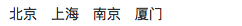


- dl-horizontal 给定义的列表实现水平显示

```html
<dl class="dl-horizontal">
    <dt>标题一</dt>
    <dd>描述内容</dd>
    <dt>标题二</dt>
    <dd>描述内容</dd>
</dl>  
```
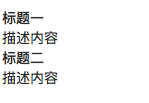

大屏显示效果

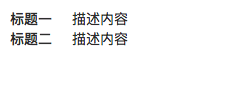

- pre-scrollable 当列表太长的时候出现y轴滑动，高度默认340px

## 代码

- kbd 标注键盘输入的代码

```html
<p>请使用<kbd>ctrl+x</kbd>复制代码，然后使用<kbd>ctrl+shift+v</kbd>将复制的代码粘贴到需要的地方。</p>
```

## 表格

- table 基础表格
- table-striped 斑马线表格
- table-bordered 带边框的表格
- table-hover 鼠标悬停高亮
- table-condensed 紧凑型表格
- table-responsive 响应的表格

- 表格行的颜色

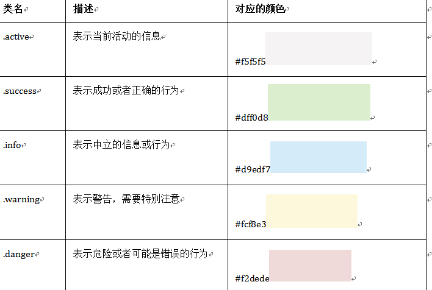


## 表单

- form-group 默认垂直显示表单

```html
<form role="form">
  <div class="form-group">
    <label for="exampleInputEmail1">邮箱：</label>
    <input type="email" class="form-control" id="exampleInputEmail1" placeholder="请输入您的邮箱地址">
  </div>
  <div class="form-group">
    <label for="exampleInputPassword1">密码</label>
    <input type="password" class="form-control" id="exampleInputPassword1" placeholder="请输入您的邮箱密码">
  </div>
  <div class="checkbox">
    <label>
      <input type="checkbox"> 记住密码
    </label>
  </div>
  <button type="submit" class="btn btn-default">进入邮箱</button>
</form>	
```

- form-horizontal 水平表单风格， 小屏下会变为垂直显示

```html
<form class="form-horizontal" role="form">
  <div class="form-group">
    <label for="inputEmail3" class="col-sm-2 control-label">邮箱</label>
    <div class="col-sm-10">
      <input type="email" class="form-control" id="inputEmail3" placeholder="请输入您的邮箱地址">
    </div>
  </div>
  <div class="form-group">
    <label for="inputPassword3" class="col-sm-2 control-label">密码</label>
    <div class="col-sm-10">
      <input type="password" class="form-control" id="inputPassword3" placeholder="请输入您的邮箱密码">
    </div>
  </div>
  <div class="form-group">
    <div class="col-sm-offset-2 col-sm-10">
      <div class="checkbox">
        <label>
          <input type="checkbox"> 记住密码
        </label>
      </div>
    </div>
  </div>
  <div class="form-group">
    <div class="col-sm-offset-2 col-sm-10">
      <button type="submit" class="btn btn-default">进入邮箱</button>
    </div>
  </div>
</form>
```

- sr-only 不显示label里面的东西

```html
<form class="form-inline" role="form">
  <div class="form-group">
    <label class="sr-only" for="exampleInputEmail2">邮箱</label>
    <input type="email" class="form-control" id="exampleInputEmail2" placeholder="请输入你的邮箱地址">
  </div>
  <div class="form-group">
    <label class="sr-only" for="exampleInputPassword2">密码</label>
    <input type="password" class="form-control" id="exampleInputPassword2" placeholder="请输入你的邮箱密码">
  </div>
  <div class="checkbox">
    <label>
      <input type="checkbox"> 记住密码
    </label>
  </div>
  <button type="submit" class="btn btn-default">进入邮箱</button>
</form> 
```
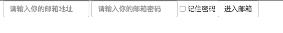


- form-control 单行输入框， 可以修改.form-control:focus来改变焦点样式
- 下拉选择和多行选择

```html
<form role="form">
  <div class="form-group">
    <select class="form-control"> 
      <option>1</option> 
      <option>2</option> 
      <option>3</option> 
      <option>4</option> 
      <option>5</option> 
      </select>
  </div>
  <div class="form-group">
      <select multiple class="form-control"> 
        <option>1</option> 
        <option>2</option> 
        <option>3</option> 
        <option>4</option> 
        <option>5</option> 
      </select>
  </div>
</form>
```

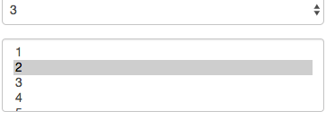

- checkbox radio都使用label包起来

```html
<div class="checkbox">
    <label>
      <input type="checkbox" value="">
      记住密码
    </label>
  </div>
  <div class="radio">
    <label>
      <input type="radio" name="optionsRadios" id="optionsRadios1" value="love" checked>
      喜欢
    </label>
  </div>
    <div class="radio">
    <label>
      <input type="radio" name="optionsRadios" id="optionsRadios2" value="hate">
      不喜欢
    </label>
  </div>
```
- 一组水平checkbox或者水平radio 需要在label上加checkbox-inline 或 radio-inline 如果radio需要一组 它们name要一样

- input-lg比一般控件大 input-sm 比一般控件小

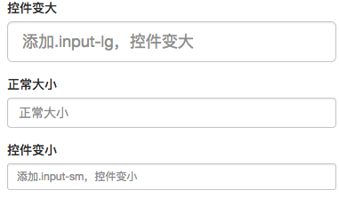

- disabled 禁用状态可以给input fieldset加

- 表单校验 has-warning 警告状态 has-error 错误状态 has-success 成功状态

```html
<form role="form">
  <div class="form-group has-success has-feedback">
    <label class="control-label" for="inputSuccess1">成功状态</label>
    <input type="text" class="form-control" id="inputSuccess1" placeholder="成功状态" >
    <span class="glyphicon glyphicon-ok form-control-feedback"></span>
  </div>
  <div class="form-group has-warning has-feedback">
    <label class="control-label" for="inputWarning1">警告状态</label>
    <input type="text" class="form-control" id="inputWarning1" placeholder="警告状态">
    <span class="glyphicon glyphicon-warning-sign form-control-feedback"></span>
  </div>
  <div class="form-group has-error has-feedback">
    <label class="control-label" for="inputError1">错误状态</label>
    <input type="text" class="form-control" id="inputError1" placeholder="错误状态">
    <span class="glyphicon glyphicon-remove form-control-feedback"></span>  
  </div>
</form> 
```

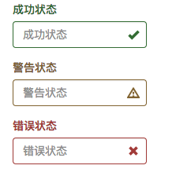

- 表单提示信息 help-block help-inline 提示信息块状显示

```html
<form role="form">
  <div class="form-group has-success has-feedback">
    <label class="control-label" for="inputSuccess1">成功状态</label>
    <input type="text" class="form-control" id="inputSuccess1" placeholder="成功状态" >
    <span class="help-block">你输入的信息是正确的</span>
    <span class="glyphicon glyphicon-ok form-control-feedback"></span>
  </div>
  <div class="form-group has-warning has-feedback">
    <label class="control-label" for="inputWarning1">警告状态</label>
    <input type="text" class="form-control" id="inputWarning1" placeholder="警告状态">
    <span class="help-block">请输入正确信息</span>
    <span class="glyphicon glyphicon-warning-sign form-control-feedback"></span>
  </div>
  <div class="form-group has-error has-feedback">
    <label class="control-label" for="inputError1">错误状态</label>
    <input type="text" class="form-control" id="inputError1" placeholder="错误状态">
    <span class="help-block">请输入正确信息</span>
    <span class="glyphicon glyphicon-remove form-control-feedback"></span>  
  </div>
</form> 
```
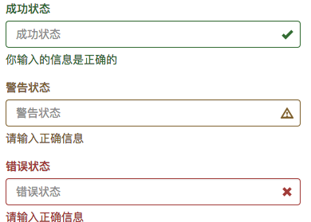

## 按钮

- btn-lg btn-sm btn-xs 按钮的大小

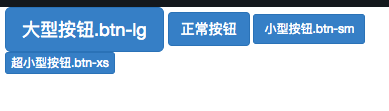

- btn-block 显示为块

- 按钮disabled  可以加类 也可以加属性 disabled="disabled"

- btn-group 按钮组

- btn-toolbar 比按钮组更得的容器 可用于富文本编辑器

- btn-group-vertical 垂直按钮分组

- btn-group-justified 等分按钮组

## 图片

- img-responsive 响应图片
- img-rounded 圆角图片
- img-circle 圆形图片
- img-thumbnail 缩略图片

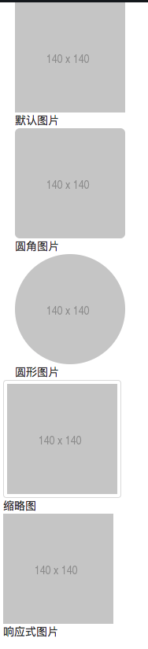


## 面包导航

```html
<ol class="breadcrumb">
  <li><a href="#">首页</a></li>
  <li><a href="#">我的书</a></li>
  <li class="active">《图解CSS3》</li>
</ol>
```
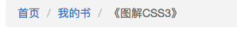


## 分页

```html
<ul class="pagination pagination">
  <li><a href="#">&laquo;第一页</a></li>
  <li><a href="#">11</a></li>
  <li><a href="#">12</a></li>
  <li class="active"><a href="#">13</a></li>
  <li><a href="#">14</a></li>
  <li><a href="#">15</a></li>
  <li class="disabled"><a href="#">最后一页&raquo;</a></li>
</ul> 
```
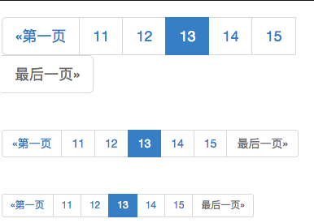

- 可以将pagination 改为pagination-lg pagination-sm 改变分页大小

- 翻页

```html
<ul class="pager">
  <li><a href="#">&laquo;上一页</a></li>
  <li><a href="#">下一页&raquo;</a></li>
</ul> 
<!--左右对齐-->
<ul class="pager">
  <li class="previous"><a href="#">&laquo;上一页</a></li>
  <li class="next"><a href="#">下一页&raquo;</a></li>
</ul> 
<!--禁止状态-->
<ul class="pager">
  <li class="disabled"><span>&laquo;上一页</span></li>
  <li><a href="#">下一页&raquo;</a></li>
</ul>  
```
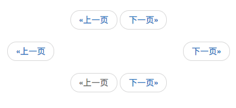

## 标签

- label-default label-primary label-success label-info label-warning label-danger

## 徽章

- badge 

```html
<button class="btn btn-primary" type="button">
      Messages <span class="badge">4</span>
</button> 
```
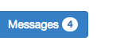


## 缩略图

- 只有缩略图

```html
<div class="container">
    <div class="row">
		<div class="col-xs-6 col-md-3">
			<a href="#" class="thumbnail">
				
			</a>
		</div>
		<div class="col-xs-6 col-md-3">
			<a href="#" class="thumbnail">
				
			</a>
		</div>
		<div class="col-xs-6 col-md-3">
			<a href="#" class="thumbnail">
				
			</a>
		</div>
		<div class="col-xs-6 col-md-3">
			<a href="#" class="thumbnail">
				
			</a>
		</div>
	</div>
```
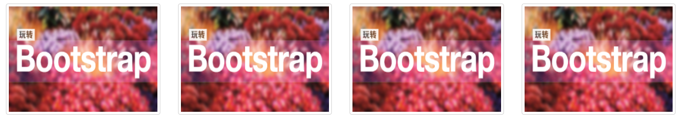

- 带描述的缩略图

```html
<div class="container">
    <div class="row">
		<div class="col-xs-6 col-md-3">
			<a href="#" class="thumbnail">
				
			</a>
			<div class="caption">
				<h3>Bootstrap框架系列教程</h3>
				<p>Bootstrap框架是一个优秀的前端框，就算您是一位后端程序员或者你是一位不懂设计的前端人员，你也能依赖于Bootstrap制作做优美的网站...</p>
				<p>
					<a href="##" class="btn btn-primary">开始学习</a>
					<a href="##" class="btn btn-info">正在学习</a>
				</p>
			</div>  
		</div>
	    <div class="col-xs-6 col-md-3">
	    	<a href="#" class="thumbnail">
		    	
		    </a>
		    <div class="caption">
		    	<h3>Bootstrap框架系列教程</h3>
	    		<p>	Bootstrap框架是一个优秀的前端框，就算您是一位后端程序员或者你是一位不懂设计的前端人员，你也能依赖于Bootstrap制作做优美的网站...</p>
		    	<p>
			    	<a href="##" class="btn btn-primary">开始学习</a>
		    		<a href="##" class="btn btn-info">正在学习</a>
			    </p>
		    </div>   
    	</div>
    	<div class="col-xs-6 col-md-3">
		    <a href="#" class="thumbnail">
			    
		    </a>
		    <div class="caption">
			    <h3>Bootstrap框架系列教程</h3>
				    <p>Bootstrap框架是一个优秀的前端框，就算您是一位后端程序员或者你是一位不懂设计的前端人员，你也能依赖于Bootstrap制作做优美的网站...</p>
				    <p>
				    	<a href="##" class="btn btn-primary">开始学习</a>
				    	<a href="##" class="btn btn-info">正在学习</a>
			    	</p>
		    </div>   
	    </div>
	    <div class="col-xs-6 col-md-3">
	    	<a href="#" class="thumbnail">
			    
		    </a>
		    <div class="caption">
			    <h3>Bootstrap框架系列教程</h3>
		    	<p>Bootstrap框架是一个优秀的前端框，就算您是一位后端程序员或者你是一位不懂设计的前端人员，你也能依赖于Bootstrap制作做优美的网站...</p>
		    	<p>
			    	<a href="##" class="btn btn-primary">开始学习</a>
			    	<a href="##" class="btn btn-info">正在学习</a>
			    </p>
	    	</div>   
	    </div>
	</div>
</div>
```
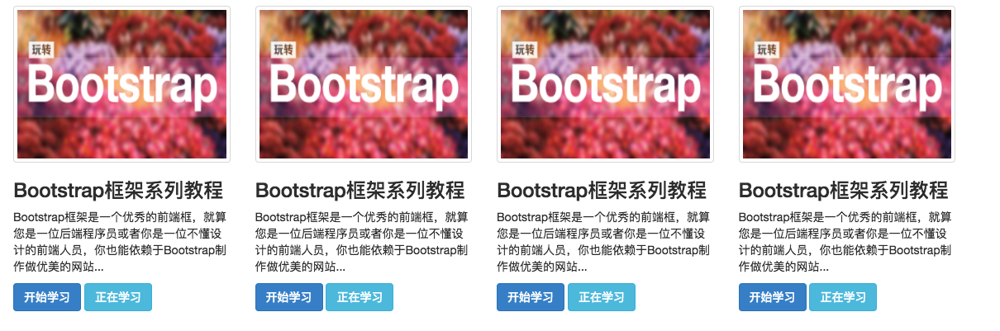

## 警示框

- alter-success 成功 alert-info 信息 alert-warning 警告 alert-danger 微信

```html
<div class="alert alert-success" role="alert">恭喜您操作成功！</div>
```

- 带关闭的 alert-dismissable

```html
<div class="alert alert-info alert-dismissable" role="alert">
	<button class="close" type="button" data-dismiss="alert">&times;</button>
	请输入正确的密码
</div>
```

- alert-link 警告框中信息有外链
```html
<div class="alert alert-info" role="alert">
	<strong>Heads up!</strong>
	 This 
	 <a href="#" class="alert-link">alert needs your attention</a>
	 , but it's not super important.
</div>
```
## 进度条

- 基本款

```html
<div class="progress">
     <div class="progress-bar" style="width:40%">
    </div>
</div>
```

- 彩色 progress-bar-success progress-bar-info progress-bar-warning progress-bar-danger

- 带条纹的进度条 progress-striped

```html
<div class="progress progress-striped">
    <div class="progress-bar progress-bar-success" style="width:40%"></div>
</div>
```

- 动态的进度条

```html
<div class="progress progress-striped active">
    <div class="progress-bar progress-bar-success" style="width:40%"></div>
</div>
```
- 层叠进度条

```html
<div class="progress">
	<div class="progress-bar progress-bar-success" style="width:20%"></div>
	<div class="progress-bar progress-bar-info" style="width:20%"></div>
	<div class="progress-bar progress-bar-warning" style="width:30%"></div>
	<div class="progress-bar progress-bar-danger" style="width:15%"></div>
</div>  
```

- 带label 的进度条

```html
<div class="progress">
    <div class="progress-bar progress-bar-success"  role="progressbar" aria-valuenow="20" aria-valuemin="0" aria-valuemax="100" style="width:20%">20%</div>  
</div> 
```


## 列表组

- 基础

```html
<ul class="list-group">
    <li class="list-group-item">揭开CSS3的面纱</li>
    <li class="list-group-item">CSS3选择器</li>
	<li class="list-group-item">CSS3边框</li>
	<li class="list-group-item">CSS3背景</li>
	<li class="list-group-item">CSS3文本</li>
</ul>
```
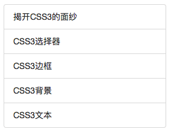

- 自定义

```html
<h3>自定义列表组</h3>
<div class="list-group">
    <a href="##" class="list-group-item">
    	<h4 class="list-group-item-heading">图解CSS3</h4>
		<p class="list-group-item-text">详细讲解了选择器、边框、背景、文本、颜色、盒模型、伸缩布局盒模型、多列布局、渐变、过渡、动画、媒体、响应Web设计、Web字体等主题下涵盖的所有CSS3新特性...</p>
	</a>
	<a href="##" class="list-group-item">
		<h4 class="list-group-item-heading">Sass中国</h4>
		<p class="list-group-item-text">致力于为中国开发者提供最全面，最具影响力，最前沿的Sass相关技术与教程...</p>
	</a>
</div>
```
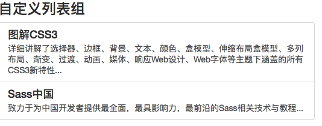


- 凸显 可以active 在list-group-item后加

- 也可以带徽章

```html
<ul class="list-group">
    <li class="list-group-item">
		<span class="badge">13</span>揭开CSS3的面
	</li>
	<li class="list-group-item">
		<span class="badge">456</span>CSS3选择器
	</li>
	<li class="list-group-item">
		<span class="badge">892</span>CSS3边框
	</li>
	<li class="list-group-item">
		<span class="badge">90</span>CSS3背景
	</li>
	<li class="list-group-item">
		<span class="badge">1290</span>CSS3文本
	</li>
</ul>
```
- 也可以设置多种颜色的列表 
    - list-group-item-success
    - list-group-item-info
    - list-group-item-warning
    - list-group-item-danger

## 面板

- 基础面板 可以去掉panel-heading panel-footer 只留panel-body

```html
<div class="panel panel-default">
    <div class="panel-heading">图解css</div>
    <div class="panel-body">详细讲解了选择器、边框、背景、文本、颜色、盒模型、伸缩布局盒模型、多列布局、渐变、过渡、动画、媒体、响应Web设计、Web字体等主题下涵盖的所有CSS3新特性</div>
    <div class="panel-footer">作者：may</div>
</div>
```
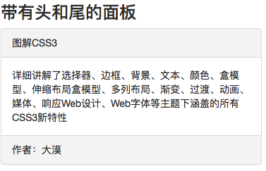

- 多种颜色面板 加载最外层div上 panel-primary panel-success panel-info panel-warning panel-danger 

- 面板中可以嵌套表格也可以嵌套列表组

## 弹出窗modal

- 要引入bootstrap-modal.js

```html
<div class="modal" id="mymodal">
    <div class="modal-dialog">
        <div class="modal-content">
    		<div class="modal-header">
				<button type="button" class="close" data-dismiss="modal"><span aria-hidden="true">&times;</span><span class="sr-only">Close</span></button>
				<h4 class="modal-title">模态弹出窗标题</h4>
			</div>
			<div class="modal-body">
				<p>模态弹出窗主体内容</p>
			</div>
			<div class="modal-footer">
				<button type="button" class="btn btn-default" data-dismiss="modal">关闭</button>
				<button type="button" class="btn btn-primary">保存</button>
			</div>
		</div><!-- /.modal-content -->
	</div><!-- /.modal-dialog -->
</div>
```

```js
$(function () {
    $(".btn").click (function () {
        $("#mymodal").modal("toggle");
    })
})
```
    - modal-dialog 水平居中
    
    - modal-header 包括头部和关闭按钮

    - modal-body 弹出的内容页

    - modal-footer 操作的按钮
    
    - show 在最外层div增加默认显示
    
- 通过data-target 实现触发    

```html
<button class="btn btn-primary" data-toggle="modal" data-target="#mymodal-data" type="button">通过data-target触发</button>
<!-- 模态弹出窗内容 -->
<div class="modal" id="mymodal-data" tabindex="-1" role="dialog" aria-labelledby="mySmallModalLabel" aria-hidden="true">
    <div class="modal-dialog">
        <div class="modal-content">
            <div class="modal-header">
                <button type="button" class="close" data-dismiss="modal"><span aria-hidden="true">&times;</span><span class="sr-only">Close</span></button>
                <h4 class="modal-title">模态弹出窗标题</h4>
            </div>
            <div class="modal-body">
                <p>模态弹出窗主体内容</p>
            </div>
            <div class="modal-footer">
                <button type="button" class="btn btn-default" data-dismiss="modal">关闭</button>
                <button type="button" class="btn btn-primary">保存</button>
            </div>
        </div>
    </div>
</div>
```

- 通过a触发

```html
<a data-toggle="modal" href="#mymodal" class=" btn btn-primary" >点击我会弹出模态弹出窗</a>
<!-- 模态弹出窗 -->
<div class="modal fade"  id="mymodal" >
    <div class="modal-dialog" >
        <div class="modal-content" >
        <!-- 模态弹出窗内容 -->
        </div>
    </div>
</div>
```

- 通过js触发

```js
$(function(){
  $(".btn").click(function(){
    $("#mymodal").modal();
  });
});
```
    js触发参数定义
    
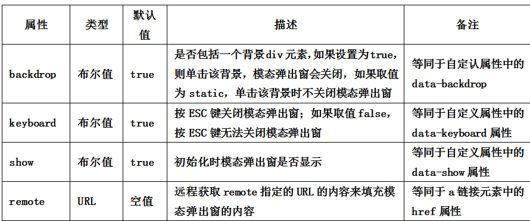
```js
$(function(){
    $(".btn").click(function(){
        $("#mymodal").modal({
            keyboard:false
        });
    });
});
```

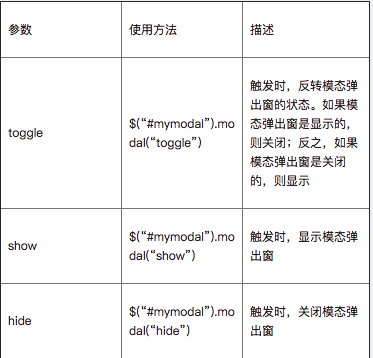

```js
$(function(){
    $(".btn").click(function(){
      $("#mymodal").modal("toggle");
    });
  });
```
- 事件模拟

```js
$('#myModal').on('hidden.bs.modal', function (e) {
    // 处理代码...
})
```

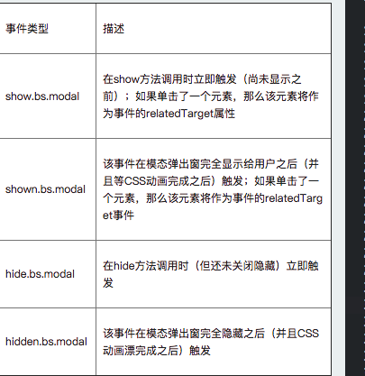


- modal可以调节尺寸 和modal-dialog一个层 modal-dialog modal-sm modal-lg
- 还可以调节modal背景遮罩的大小样式.modal-backdrop

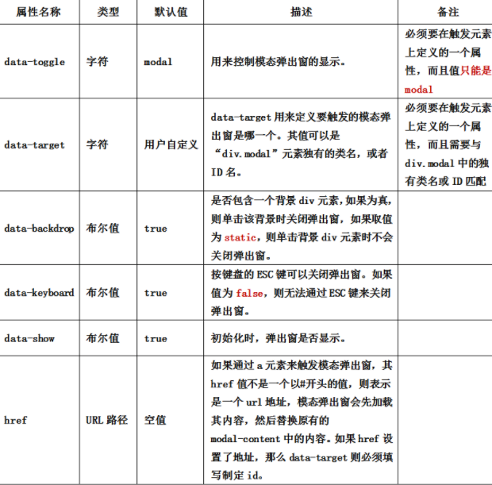


## 动画过渡

要引入bootstrap-transition.js 增加fade 增加渐变的的动画

```html
<div class="modal fade" id="mymodal">
    <div class="modal-dialog">
        <div class="modal-content">
        	<div class="modal-header">
				<button type="button" class="close" data-dismiss="modal"><span aria-hidden="true">&times;</span><span class="sr-only">Close</span></button>
				<h4 class="modal-title">模态弹出窗标题</h4>
			</div>
			<div class="modal-body">
				<p>模态弹出窗主体内容</p>
			</div>
			<div class="modal-footer">
				<button type="button" class="btn btn-default" data-dismiss="modal">关闭</button>
				<button type="button" class="btn btn-primary">保存</button>
			</div>
		</div><!-- /.modal-content -->
	</div><!-- /.modal-dialog -->
</div>
```

