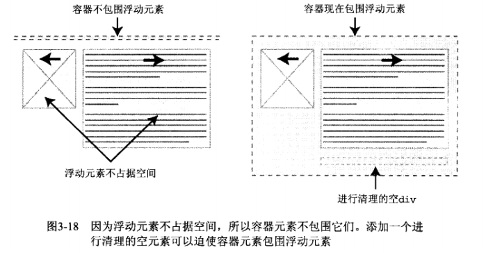
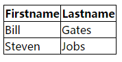
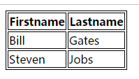
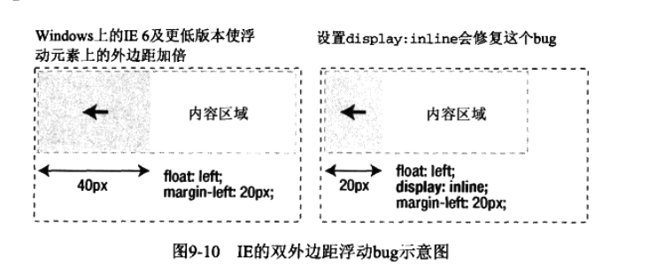

虽然书比较老，但是讲的很好，以前没有注意到的问题都得到了解答


<!-- more -->

# 基础知识

- 在分配ID和类名时，一定要尽可能保持名称与表现方式无关

应该根据它们是什么来为元素命名，而不是应该根据它们外观如何来命名。这种方式会让代码更有意义

 差的名称 | 好的名称 |
----|------
red | error
leftColumn | secondaryContent
topNav | mainNav
firstPara | intro


- 尽可能使用class,但也不能用的太多给每个element都加class也是不正确，考虑吧这些元素分解成它们的组成部分，让代码更组件化

- 只在没有体现元素能够实现区域分割的情况下使用div


bad

```html
<div class="nav">

<ul>
    <li></li>a
    <li></li>
    <li></li>
</ul>
</div>

```

good 

```html
<ul class="nav">
    <li></li>
    <li></li>
</ul>
```

完全删除div,直接在列表上应用类

- 过度使用div是代码结构不合理而且过分复杂，div可以对会计元素进行分组，而span可以用来对行内元素进行分组或标识

- DTD 文档类型定义 是一组机器可读的规则，在解析网页时浏览器使用这些规则检查页面

- DOCTYPE 声明是指HTML文档开头处的一行或者梁行代码，描述使用哪个DTD,但不总是包含DTD文档的URL,例如H5
目前有两个风格严格和过渡，过渡是从老板到新版本

- 校验代码
    - validator.w3.org 
    - chrome 插件 Web Developers Extension
    
- 浏览器模式
    - 标准模式
    - 混杂模式 页面以一种向后兼容的方式显示，通常用来模拟老式浏览器
    
- DOCTYPE 切换 浏览器根据DOCTYPE是否存在以及使用的哪种DTD来选择要使用的呈现方式
    - 如果有完整的DOCTYPE,那么一般以标准模式横线
    - 如果包含过渡的，或者是错误DTD，会选择混杂模式呈现
    

# 为样式找到应用目标

## 常用的选择器

类选择器  p {} h1 {}

后代选择器 div p {}

ID选择器和类选择器 

伪类


## 通用选择器

`* {}`

## 高级选择器

- 子选择器和相邻同胞选择器  #nav > li{}  h2 + p {}

- 属性选择器 p[title] {}
 
- 层叠和特殊性

选择器的特殊性氛围4个成分等级：a b c d

 选择器 | 特殊性 | 以10为技术的特殊性
----|------|------
style="" | 1,0,0,0 | 1000
#wrapper #content {}| 0,2,0,0 | 200
 div#content {} | 0,1,1,0 | 110
 #content {} |　0,1,0,0 | 100
 p.content.dateposted {} | 0,0,2,1| 21
 p.content | 0,0,1,1 | 11
 div p {} | 0,0,0,2 | 2
 p {} | 0,0,0,1 | 1
 
 如果在特殊页面上需要覆盖class的样式，可以在主题标签上添加id来标识页面
 
 - 继承
 
## 规划、组织和维护样式表
 
### 对文档应用样式


```html
<link href="css.css" rel="stylesheet" type="text/css"> // 链接样式

@import url('css.css'); // 导入样式
```

导入样式比链接样式慢，但是可以分割css便于维护

可以在css文件中进行注释 `/* @group typography */` 加一个@ 方便搜索

- 设计代码的结构， 可以将代码划分为几大块，把最一般的规则放在最前，特殊的和辅助的放在后面

- 自我提示 使用 `@todo`表示某些东西需要进行修改、复查 用`@bugfix`表示代码或者特定浏览器遇到的问题 `@workaround`表示不完善的权宜之计
 
```css
/* @bugfix: rule breaks in IE */
```

- 启用服务器端压缩

# 可视化格式模型

## 盒模型

outline属性与border属性不同，轮廓绘制在元素框之上，不影响元素的大小或者定位

外边界10px,5px的内边距，如果希望这个框达到100px像素宽，需要内容的宽度设为70px

```css
.box {
    margin： 10px;
    padding: 5px;
    width: 70px;
}

```

在IE的早期版本，混杂模式中使用自己的非标准盒模型，它会将内容、内边距、边框加为宽度的总和

css3 的box-sizing属性可以定义使用哪种盒模型

- 外边距叠加
 
   - 相邻的情况 

```html
<div class="box" style="margin-bottom: 30px"></div>
<div class="box" style="margin-top: 20px"></div> 
```


 
叠加后会变成 `margin-bottom`的30px,可以理解成谁大听谁的，如果一样大，就取他们的等值
    
   - 嵌套的情况

```html
<div style="margin-top: 30px; background: red; height: 50px;">
    <div  style="margin-top: 20px; height: 30px;"></div>
</div>
```

这种情况下外边距的top和里面元素的top值重叠在一起，发生叠加，最后在外边距形成一个30 的top值，谁大听谁的


如果没有外边距的叠加，后续所有的段落之间的空间都僵尸顶外边距和底外边距的和，段落之间的间接是两倍，如果有叠加，意味着各处的距离就一致了

## 定位概述

css中有3总基本定位机制：普通流、浮动和绝对定位。一般都是普通流中定位

### 相对定位流 position:relative 让这个元素相对于之前的文档流移动

### 绝对定位 使元素的位置与文档流无关，不占据空间。位置是相对于距离它最近的那个已定位的祖先元素确定的，因为脱离文档流可以通过z-index设置框的叠放次序

### 固定定位 绝对定位的一种，能够创建总是出现在窗口相同位置的浮动元素

### 浮动 不在文档流中
    
   - 清除浮动，让周围的元素为浮动元素留出空间
    
    
    
   - overflow 属性定义的包含在内容对于制定的尺寸太大情况下元素应该怎么样，而值为hidden或auto的副作用会自动清理包含任何浮动元素
   - 设置特定的类
    
```css
.clear:after {
content: '.';
height: 0;
visibility: hidden;
display: block;
clear: both;
}
```

# 背景图片效果

## 背景图像基础

不要将像素或者百分数等单位与关键字混合使用

## 圆角框

在设置圆角框背景的时候可以X设置固定的bg,y轴设置repeat-y的bg,这样背景框可以随着文字的改变而随文字变化

如果需要更加灵活的圆角背景框 需要设置top-left、top-right、bottom-left、bottom-right 四张图

border-image 三个参数（图片，剪裁，重复性）,

```css
.border-image {
width: 400px;
height: 300px;
border: 1em double orange;
border-image: url(...png) 27;
}
```

其中 27表示以27像素剪裁图片宽高

- 27 round 表示 平铺的效果
- 27 repeat 表示重复的效果

也可以通过border-width样式和border-image 分别设置四边的图像

```css
.border-image {
    border-image: url(...png) 2 5 6 2;
    border-width: 2px 5px 6px 2px;
}
```

这种样式可以理解成将url 这张图片分别 取 上右下左的距离 映射到背景边框上

## 投影

可以给需要投影的div 增加一个容器，给这个容器设置背景，并设置一定的偏移量

```css
.img-wrapper img {
     margin: -5px 5px 5px -5px;
}
```

box-shadow：共6个参数 阴影类型 X-offset Y-offset 阴影模糊半径 阴影扩展半径 阴影颜色

## 不透明度 

- opacity

```css
.alert {
    opacity: 0.8;
}
```

- rgba

- png 可以支持alpha透明，但是ie6不直接支持

- 视觉差 对多个背景图片做位置设定，当调整这些位置的时候，就会造成视觉差

# 对链接应用样式


L-V-H-A 的顺序定义样式，否则后面的样式覆盖前前面的样式

如果想自定义a标签的下划线样式，可以通过背景的方法设置

如果同页面锚点的跳转，想突显跳转后元素的样式，可以采用target这个伪类

对跳转到外部的链接设置提示icon

```css
a[href^="http:"] {
    background: url(...)
}
```

也可以突显其他例如email、下载等等

使用line-height 来控制按钮的高度，而不是用height,但是如果按钮中是两行文本就会将高度变为原来的两倍，这个只能调整按钮和文本尺寸


tooltip

```html
<p>
    <a href="www.baidu.com" class="tooltip">
        Andy Buddy
        <span>(This website rocks)</span>
    </a>
    is a web developwe based in Brighton England
</p>
```

```css
a.tooltip {
            position: relative;
        }

        a.tooltip span {
            display: none;
        }

        a.tooltip:hover span, a.tooltip:focus span {
            display: block;
            position: absolute;
            top: 1em;
            left: 2em;
            padding: 0.2em 0.6em;
            border: 1px solid #996633;
            background-color: #ffff66;
            color: #000;
        }
```

# 对列表应用样式和创建导航条

# 对表单和数据表格应用样式

## 表格

### 表格的特有元素

第一个元素是caption表格的标题，summary属性应用于表格标签，用来描述表格的内容，类似图像的alt文本

```html
<table border="6">
<caption  summary="标题">我的标题</caption>
<tr>
  <td>100</td>
  <td>200</td>
  <td>300</td>
</tr>
<tr>
  <td>400</td>
  <td>500</td>
  <td>600</td>
</tr>
</table>
```

### 表格样式样式
- border-collapse 

属性设置为collapse



属性设置为separate



- border-spacing 可以控制表格之间的距离

## 表单

- fieldset 对相关信心块进行分组

- label 元素可以帮助添加结构增加表单的可用性和可访问性

- input 控件

将标签和控件关联起来


隐形方式
```html
<label>email<input name="email" type="text"></label>
```
显示方式

```html
<label for="email">email</label>
<input name="email" id="email" type="text">
```

在表单输入控件和标签之间创建关联需要id属性，二表单数据发送回服务器需要name属性。id,name尽可能一致

- 必填项 可以用em 或 strong元素来强调

简单的表单布局可以考虑垂直型的而复杂的表单布局可以考虑水平的布局，而想使用水平布局可以将标签左浮动，并设置宽度

```css
label {

    float: left;
    width: 10em;
    cursor: pointer;
}
```

- 即使有些地方需要隐藏标签，写需要在源代码中体现，这个可以帮助屏幕阅读器使用，者仍然很重要。

可以将需要隐藏的标签的高度设为0，display: none; text-indent:-1000em;

- 提交按钮

```html
<button type="submit"></button>
```

通常建议使用button， 各个系统中input样式定义不同，为了一致性可以考虑button

- 表单返回

```html
<div>
<label for=email">
<em class="feedback">please try again.</em>
</label>
<input name="email" id="email" type="text" >
</div>
```

# 布局

- 首先检查设计，寻找重复的模式，不应该关注表现方式，应该注重结构和意义

- 将页面划分为大的机构性区域，然后将注意力转移到内容区域本身

- 在各个内容区域中寻找不同的布局结构


## 流性布局

使用百分数而不是像素设置，在必要的时候加min-width,防止布局太窄

## 弹性布局

弹性布局相对于字号来设置元素的宽度，以em为单位设置宽度，确保字号增加布局随之扩大

## 图片的布局

```html
<div class="branding">
    
</div>
```

```css
#branding {
    width: 100%;
    overflow: hidden;
}
```

## faux 列

- 针对固定宽度的两列布局，只需要在容器元素上应用一个垂直重复的背景图片，宽度与导航区域相同

```css
#wrapper {
    background: #fff url(...) repeat-y left top;
}
```

## 高度相等的列

- overflow padding  margin

给每个框设置打的底边距，然后数值相似的负外边界消除这个高度,父级使用overflow: hidden

```css
.box {
    width: 250px;
    float: left;
    margin-left: 20px;
    display: inline;
    padding: 20px;
    background: #ccc;
    padding-bottom: 500px;
    margin-bottom: -500px;
    display: inline;
}

.bottom {
    position: absolute;
    bottom: 0;
    height: 20px;
    width: 290px;
}
```

```html
<div class="wrapper">
    <div class="box">
        <h1>andy buddy</h1>
        <p>健康微能量2015年初推出医帮医——移动健康云协作平台，任何一名医生，都可以在手机上与全国三甲医生协作，开展科普、科研分诊、转诊、随诊、预约就诊及会诊等服务。北京、上海地区的三甲医院有上万名医务工作者加入这个协作平台。都可以在手机上与全国三甲医生协作，开展科普、科研、分诊、转诊、随诊、预约就诊及会诊等服务。北京、上海地区的三甲医院有上万名医务工作者加入这个协作平台…开展科普、科研分诊、转诊、随诊、预约就诊及会诊等服务。北京、上海地区的三甲医院有上万名医务工作者加入这个协作平台。都可以在手机上与全国三甲医生协作，开展科普、科研、分诊、转诊、随诊、预约就诊及会诊等服务。北京、上海地区的三甲医院有上万名医务工作者加入这个协作平台开展科普、科研分诊、转诊、随诊、预约就诊及会诊等服务。北京、上海地区的三甲医院有上万名医务工作者加入这个协作平台。都可以在手机上与全国三甲医生协作，开展科普、科研、分诊、转诊、随诊、预约就诊及会诊等服务。北京、上海地区的三甲医院有上万名医务工作者加入这个协作平台</p>
    </div>
    <div class="box">
        <h1>andy buddy</h1>
        <p>健康微能量2015年初推出医帮医——移动健康云协作平台，任何一名医生，都可以在手机上与全国三甲医生协作，开展科普、科研分诊、转诊、随诊、预约就诊及会诊等服务。北京、上海地区的三甲医院有上万名医务工作者加入这个协作平台。都可以在手机上与全国三甲医生协作，开展科普、科研、分诊、转诊、随诊、预约就诊及会诊等服务。北京、上海地区的三甲医院有上万名医务工作者加入这个协作平台…开展科普、科研分诊、转诊、随诊、预约就诊及会诊等服务。北京、上海地区的三甲医院有上万名医务工作者加入这个协作平台。都可以在手机上与全国三甲医生协作，开展科普、科研、分诊、转诊、随诊、预约就诊及会诊等服务。北京、上海地区的三甲医院有上万名医务工作者加入这个协作平台开展科普、科研分诊、转诊、随诊、预约就诊及会诊等服务。北京、上海地区的三甲医院有上万名医务工作者加入这个协作平台。都可以在手机上与全国三甲医生协作，开展科普、科研、分诊、转诊、随诊、预约就诊及会诊等服务。北京、上海地区的三甲医院有上万名医务工作者加入这个协作平台</p>
    </div>
    <div class="box">
        <h1>andy buddy</h1>
        <p>健康微能量2015年初推出医帮医——移动健康云协作平台，任何一名医生，都可以在手机上与全国三甲医生协作，开展科普、科研分诊、转诊、随诊、预约就诊及会诊等服务。北京、上海地区的三甲医院有上万名医务工作者加入这个协作平台。都可以在手机上与全国三甲医生协作，开展科普、科研、分诊、转诊、随诊、预约就诊及会诊等服务。北京、上海地区的三甲医院有上万名医务工作者加入这个协作平台…开展科普、科研分诊、转诊、随诊、预约就诊及会诊等服务。北京、上海地区的三甲医院有上万名医务工作者加入这个协作平台。都可以在手机上与全国三甲医生协作，开展科普、科研、分诊、转诊、随诊、预约就诊及会诊等服务。北京、上海地区的三甲医院有上万名医务工作者加入这个协作平台开展科普、科研分诊、转诊、随诊、预约就诊及会诊等服务。北京、上海地区的台</p>
    </div>
</div>

```

- table 方法

```css
.table {
    width: 80%;
    margin: 2em auto;
    display: table;
    border-collapse: separate;
    border-spacing: 30px 0;
}
.row {
    display: table-row;
}
.col {
    display: table-cell;
    background-color: #ccc;
    padding: 30px;
}
```

```html
<main class="table">
    <div class="row">
        <div class="col">
            <h1>andy buddy</h1>
            <p>健康微能量2015年初推出医帮医——移动健康云协作平台，任何一名医生，都可以在手机上与全国三甲医生协作，开展科普、科研分诊、转诊、随诊、预约就诊及会诊等服务。北京、上海地区的三甲医院有上万名医务工作者加入这个协作平台。都可以在手机上与全国三甲医生协作，开展科普、科研、分诊、转诊、随诊、预约就诊及会诊等服务。北京、上海地区的三甲医院有上万名医务工作者加入这个协作平台…开展科普、科研分诊、转诊、随诊、预约就诊及会诊等服务。北京、上海地区的三甲医院有上万名医务工作者加入这个协作平台。都可以在手机上与全国三甲医生协作，开展科普、科研、分诊、转诊、随诊、预约就诊及会诊等服务。北京、上海地区的三甲医院有上万名医务工作者加入这个协作平台开展科普、科研分诊、转诊、随诊、预约就诊及会诊等服务。北京、上海地区的三甲医院有上万名医务工作者加入这个协作平台。都可以在手机上与全国三甲医生协作，开展科普、科研、分诊、转诊、随诊、预约就诊及会诊等服务。北京、上海地区的三甲医院有上万名医务工作者加入这个协作平台</p>
        </div>
        <div class="col">
            <h1>andy buddy</h1>
            <p>健康微能量2015年初推出医帮医——移动健康云协作平台，任何一名医生，都可以在手机上与全国三甲医生协作，开展科普、科研分诊、转诊、随诊、预约就诊及会诊等服务。北京、上海地区的三甲医院有上万名医务工作者加入这个协作平台。都可以在手机上与全国三甲医生协作，开展科普、科研、分诊、转诊、随诊、预约就诊及会诊等服务。北京、上海地区的三甲医院有上万名医务工作者加入这个协作平台…开展科普、科研分诊、转诊、随诊、预约就诊及会诊等服务。北京、上海地区的三甲医院有上万名医务工作者加入这个协作平台。都可以在手机上与全国三甲医生协作，开展科普、科研、分诊、转诊、随诊、预约就诊及会诊等服务。北京、上海地区的三甲医院有上万名医务工作者加入这个协作平台开展科普、科研分诊、转诊、随诊、预约就诊及会诊等服务。北京、上海地区的三甲医院有上万名医务工作者加入这个协作平台。都可以在手机上与全国三甲医生协作，开展科普、科研、分诊、转诊、随诊、预约就诊及会诊等服务。北京、上海地区的三甲医院有上万名医务工作者加入这个协作平台</p>
        </div>
        <div class="col">
            <h1>andy buddy</h1>
            <p>健康微能量2015年初推出医帮医——移动健康云协作平台，任何一名医生，都可以在手机上与全国三甲医生协作，开展科普、科研分诊、转诊、随诊、预约就诊及会诊等服务。北京、上海地区的三甲医院有上万名医务工作者加入这个协作平台。都可以在手机上与全国三甲医生协作，开展科普、科研、分诊、转诊、随诊、预约就诊及会诊等服务。北京、上海地区的三甲医院有上万名医务工作者加入这个协作平台…开展科普、科研分诊、转诊、随诊、预约就诊及会诊等服务。北京、上海地区的三甲医院有上万名医务工作者加入这个协作平台。都可以在手机上与全国三甲医生协作，开展科普、科研、分诊、转诊、随诊、预约就诊及会诊等服务。北京、上海地区的三甲医院有上万名医务工作者加入这个协作平台开展科普、科研分诊、转诊、随诊、预约就诊及会诊等服务。北京、上海地区的台</p>
        </div>
    </div>
</main>
```

- 伪类实现

```html
    <div class="main clearfix">
        <div class="box">
            健康微能量2015年初推出医帮医——移动健康云协作平台，任何一名医生，都可以在手机上与全国三甲医生协作，开展科普、科研分诊、转诊、随诊、预约就诊及会诊等服务。健康微能量2015年初推出医帮医——移动健康云协作平台，任何一名医生，都可以在手机上与全国三甲医生协作，开展科普、科研分诊、转诊、随诊、预约就诊及会诊等服务。健康微能量2015年初推出医帮医——移动健康云协作平台，任何一名医生，都可以在手机上与全国三甲医生协作，开展科普、科研分诊、转诊、随诊、预约就诊及会诊等服务。健康微能量2015年初推出医帮医——移动健康云协作平台，任何一名医生，都可以在手机上与全国三甲医生协作，开展科普、科研分诊、转诊、随诊、预约就诊及会诊等服务。
        </div>

        <div class="box">
            健康微能量2015年初推出医帮医——移动健康云协作平台，任何一名医生，都可以在手机上与全国三甲
        </div>
    </div>
```

```css
.main {
    width: 80%;
    margin: 3em auto;
    position: relative;
    overflow: hidden;
}
.box {
    float: left;
    margin: 3px;
    width: 230px;
    color: #FFFFFF;
    background-color: #FF4A59;
    box-shadow: 2px 3px 4px #846363;
}
.box:after {
    display: block;
    position: absolute;
    height: 100%;
    content: "";
    background-color:  #FF4A59;
    box-shadow: 2px 2px 4px #846363;
    width: 230px;
}
```

- 通过column-count、column-width和column-gap属性实现

```html
<div class="col">
    <p>after ......</p>
</div>
```

```css
.col {
column-count: 3;
column-width: 140px;
column-gap: 2px; // 列之间的间距
column-rule: 1px solid #ccc; // 列之间有一条线
}

```
## css 框架

缺点 要求在设计中必须使用特定的网格结构，框架定义的宽高适应你的设计。而css框架不应该决定站点的设计

# bug与bug修复

## 特殊性和分类次序的问题

> 只在需要细粒度的控制时添加更特殊的选择器

```css
.content p {
    background: red;
}

.intro {
    background: orange; // 想让p中intro的背景变为橘色
}
```

这里无法变，因为选择器的优先级不够 改为 .content .intro

## 外边距叠加的问题

> 通过添加一个垂直边框或内边框，外边距就不会叠加

```html
<div>
    <p></p>
</div>
```

```css
div {
margin: 10px;
}

p {
margin: 20px;
}
```

这样margin重叠得到是20px的垂直外边距

可以变为

```css
div{
margin: 10px;
padding: 1px;
}
```

## 修改低版本中的代码

```html
<!-- [if IE 6]
 <link rel="stylesheet" type="text/css" href="">
-->

```


## ie 低版本float浮动造成两倍外边距



# 实例研究 Roma Italia

- 轻量化各种标记，能简化的要简化

- 使用reset样式表
